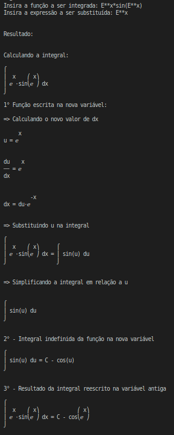
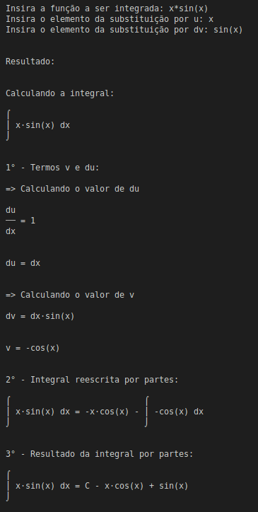
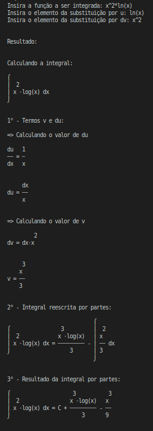

# Calculadora de Integrais

A Calculadora de Integrais é uma aplicação que permite calcular integrais de funções matemáticas. Ela oferece diferentes opções, incluindo integração indefinida, integração definida, substituição de variáveis e integração por partes. A aplicação deve ser executada no terminal, apartir do arquivo `app.py` ou `app.ipnyb`. 
Em caso de dúvidas a respeito de como são calculadas as integrais, o código do `app.py` está todo comentado.

## Requisitos

Para executar a Calculadora de Integrais, você precisa ter os seguintes requisitos instalados em sua máquina:

- Python (versão 3.6 ou superior)
- Bibliotecas Python: `sympy`

Caso prefira rodar o programa utilizando o aplicativo em Jupyter Notebook, não é necessário intalar nenhuma biblioteca.

## Instalação

1. Certifique-se de ter o Python instalado corretamente em sua máquina. Você pode verificar executando o seguinte comando no terminal:

   ```shell
   python --version
   ```
    Se o comando acima não retornar um número de versão do Python, será necessário instalar o Python antes de prosseguir.

2. Certifique-se de ter o sympy instalado corretamente em sua máquina. Você pode verificar executando o seguinte comando no terminal:
   ```shell
   pip install sympy
   ```
   Isso instalará as bibliotecas `sympy` em seu ambiente Python.

## Executando a Calculadora de Integrais

1. Clone o repositorio do GitHub do projeto
   ```shell
   git clone https://github.com/gabriel-santos/Calculadora-de-Integrais.git
   ```
2. Execute o arquivo `app.py`
   ```shell
   python3 app.py
   ```
   - Ou se preferir rodar o arquivo em Jupyter Notebook

   Execute o arquivo `app.ipynb`
   ```shell
   jupyter notebook
   ```

## Funcionalidades

- Integração Indefinida: Calcula a antiderivada de uma função.
- Integração Definida: Calcula a integral definida de uma função em um intervalo especificado.
- Substituição de Variáveis: Realiza a integração utilizando uma substituição de variáveis.
- Integração por Partes: Realiza a integração por partes de uma função.

## Exemplos

<details>
  <summary><strong>Calculando integrais indefinidas</strong></summary>

  1. ∫(3x² + 2)dx
   - Entrada: 3*(x**2) + 2
   - Saida: x*(x**2+2)
  
  <p style="text-align:center"></p>
  
  2. ∫(cos(x) + 2e^x)dx
   - Entrada: cos(x) + 2*(E**x)
   - Saida: 2*(E**x) + sin(x)
  
  <p style="text-align:center"></p>

  3. ∫(e^x + 1/x)dx
   - Entrada: E**x + 1/x
   - Saida: E**x + ln(x)

  <p style="text-align:center"></p>

  4. ∫(2sin(x) + 3cos(x))dx
   - Entrada: 2*sin(x) + 3*cos(x)
   - Saida: 2*sin(x) + 3*cos(x)
  
  <p style="text-align:center"></p>

  5. ∫(5/x²)dx
   - Entrada: 5/(x**2)
   - Saida: 5/x

  <p style="text-align:center"></p>

</details>

<details>
  <summary><strong>Calculando integrais definidas</strong></summary>

  1. ∫[0, 2] 2x dx
   - Função: 2*x
   - Limite inferior: 0
   - Limite superior: 2
   - Saída: 4

  <p style="text-align:center"></p>

  2. ∫[1, 3] (x² + 3x) dx
   - Função: x**2+3*x
   - Limite inferior: 1
   - Limite superior: 3
   - Saída: 62/3

  <p style="text-align:center"></p>

  3. ∫[0, π] sin(2x) dx
   - Função: sin(2*x)
   - Limite inferior: 0
   - Limite superior: pi
   - Saída: 0

  <p style="text-align:center"></p>

  4. ∫[0, 1] e^x dx
   - Função: E**x
   - Limite inferior: 0
   - Limite superior: 1
   - Saída: -1 + e

  <p style="text-align:center"></p>

  5. ∫[0, e] (ln(x) + x) dx
   - Função: log(x) + x
   - Limite inferior: 0
   - Limite superior: E
   - Saída: E**2/2

  <p style="text-align:center"></p>

</details>

<details>
  <summary><strong>Calculando integrais por substituição</strong></summary>

  1. ∫(2x + 1)√(x² + x + 1) dx
   - Função: (2*x + 1)*sqrt(x**2 + x + 1)
   - Valor de u: x**2 + x + 1
   - Saída: (2*(x**2+x+1)**3/2)/3

      <details>
        <summary><strong>Solução</strong></summary>
        <p style="text-align:center"></p>
      </details>

  2. ∫e^x sin(e^x) dx
   - Função: E**x*sin(E**x)
   - Valor de u: E**x
   - Saída: -cos(E**x)

      <details>
        <summary><strong>Solução</strong></summary>
        <p style="text-align:center"></p>
      </details>

  3. ∫1 / (5-3x) dx
   - Função: 1/(5-3*x)
   - Valor de u: 5-3*x
   - Saída: -1/3*log(5-3*x)

      <details>
        <summary><strong>Solução</strong></summary>
        <p style="text-align:center"></p>
      </details>

  4. ∫(x + 1)/(x² + 2x + 2) dx
   - Função: (x + 1)/(x**2 + 2*x + 2)
   - Valor de u: x**2 + 2*x + 2
   - Saída: (log(x**2 + 2*x + 2))/2

      <details>
        <summary><strong>Solução</strong></summary>
        <p style="text-align:center"></p>
      </details>

  5. ∫cos(x)√sin(x) dx
   - Função: cos(x) * sqrt(sin(x))
   - Valor de u: sin(x)
   - Saída: (2/3) * sin^(3/2)

      <details>
        <summary><strong>Solução</strong></summary>
        <p style="text-align:center"></p>
      </details>

</details>

<details>
  <summary><strong>Calculando integrais por partes</strong></summary>

  1. ∫x sin(x) dx
   - Função: x*sin(x)
   - Valor de u: x
   - Valor de dv: sin(x)
   - Saída: sin(x) - x*cos(x)

      <details>
        <summary><strong>Solução</strong></summary>
        <p style="text-align:center"></p>
      </details>

  2. ∫ln(x) dx
   - Função: ln(x)
   - Valor de u: ln(x)
   - Valor de dv: 1
   - Saída: x*ln(x) - x

      <details>
        <summary><strong>Solução</strong></summary>
        <p style="text-align:center"></p>
      </details>

  3. ∫x*cos(5x) dx
   - Função: x*cos(5*x)
   - Valor de u: x
   - Valor de dv: cos(5*x)
   - Saída: (1/5)*x*sin(5*x) + (1/25)*cos(5*x)

      <details>
        <summary><strong>Solução</strong></summary>
        <p style="text-align:center"></p>
      </details>

  4. ∫x^2 ln(x) dx
   - Função: x^2*ln(x)
   - Valor de u: ln(x)
   - Valor de dv: x^2
   - Saída: (1/3)*x^3*ln(x) - x^3/9

      <details>
        <summary><strong>Solução</strong></summary>
        <p style="text-align:center"></p>
      </details>

  5. ∫(x^2+2*x)*cos(x) dx
   - Função: (x^2+2*x)*cos(x)
   - Valor de u: x^2+2*x
   - Valor de dv: cos(x)
   - Saída: 2*x*cos(x) + (x^2  + 2*x)*sin(x) - 2*sin(x) + 2*cos(x)

      <details>
        <summary><strong>Solução</strong></summary>
        <p style="text-align:center"></p>
      </details>

</details>
